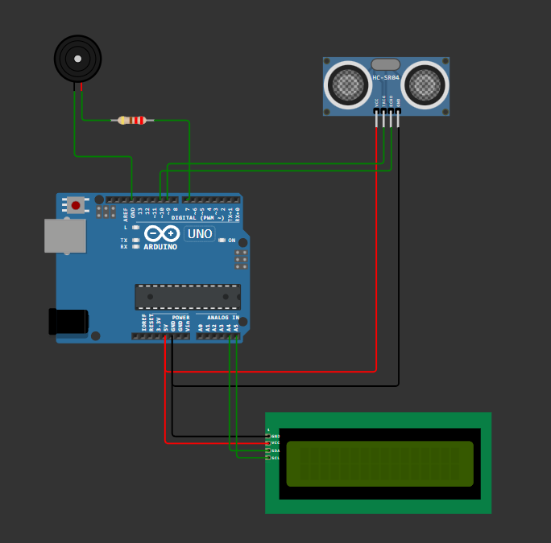

# Arduino Distance Scanner

This repository contains the source code and hardware schematics for an ultrasonic distance measurement system based on the Arduino Uno platform. The device utilizes an HC-SR04 sensor to monitor proximity in real-time, displaying the results on an I2C LCD while providing variable-frequency audio feedback via a buzzer that intensifies as objects get closer.

## Hardware Components

| Component | Specification |
| :--- | :--- |
| Arduino Uno | Main Microcontroller |
| HC-SR04 | Ultrasonic Ranging Sensor |
| I2C LCD 16x2 | Character Display |
| Buzzer | Audio Indicator |
| Resistor | 220 Ohm |

## Wiring Diagram

The visual representation of the circuit is located in the schema directory.

## Software Requirements

The following libraries must be installed in your development environment to compile the code:

* LiquidCrystal_I2C (by Frank de Brabander)
* Wire (Standard Arduino library)

## Installation and Usage

1. Clone this repository to your local machine.
2. Connect the hardware components according to the provided schematic in the schema folder.
3. Open the .ino file located in the src directory using the Arduino IDE or VS Code with PlatformIO.
4. Ensure the I2C address in the code (0x27) matches your specific LCD module.
5. Compile and upload the sketch to your Arduino Uno. 
